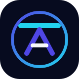

# Muhammad Jahanzaib — Portfolio

<p align="center">
  
</p>

<p align="center">
  A premium, production-grade developer portfolio built with the modern web stack —
  <strong>Next.js 16 (App Router)</strong>, <strong>React 19</strong>, <strong>TypeScript</strong>, and
  <strong>Tailwind CSS v4</strong>.
</p>

<p align="center">
  <a href="https://jahanzaib.dev"></a>
  <a href="https://nextjs.org"></a>
  <a href="https://www.typescriptlang.org"></a>
  <a href="https://tailwindcss.com"></a>
  <a href="LICENSE"></a>
</p>

---

## Overview

A sleek, dark-themed, glassmorphism personal site that showcases the work of a
**Senior Frontend Engineer** — including projects, experience, skills, achievements,
testimonials, and open-source contributions. Designed with motion-first interactions,
accessibility, and performance at its core, it ships as a fully static, SEO-optimized
Next.js application.

> Live demo: **https://jahanzaib.dev

---

## Features

| Experience | What it does |
| --- | --- |
| **Glassmorphism UI** | Frosted-glass surfaces with subtle borders, backdrop blur, and gradient accents. |
| **Smooth Scrolling** | Native-feeling momentum scrolling powered by [`lenis`](https://github.com/darkroomengineering/lenis). |
| **Custom Cursor** | Spring-physics cursor with a glowing aura (auto-disabled on touch / small screens). |
| **Scroll Progress Bar** | Gradient progress indicator driven by Framer Motion's `useScroll`. |
| **Floating Navigation** | Appears on scroll; quick anchor links to every section. |
| **Command Palette** | `⌘K` / `Ctrl+K` quick-navigation and "Download CV" action via [`cmdk`](https://github.com/pacocoursey/cmdk). |
| **Magnetic Buttons** | Pointer-tracking interactive buttons with hover gradients. |
| **Scroll Reveal Animations** | Staggered, viewport-triggered entrance animations using Framer Motion. |
| **Responsive Layout** | Mobile-first design that adapts across all breakpoints. |
| **Reduced Motion Support** | Honors `prefers-reduced-motion` for accessible motion. |
| **Loading & Error States** | Animated `loading.tsx` and graceful `error.tsx` boundaries. |
| **SEO & Social Cards** | Full Open Graph, Twitter, and canonical metadata with `metadataBase`. |

### Sections

`Hero` · `About` · `Skills` · `Projects` · `Experience` · `Testimonials` ·
`Open Source` · `Achievements` · Awards timeline · `Contact` · `Footer`

---

## Tech Stack

| Technology | Version | Role |
| --- | --- | --- |
| [Next.js](https://nextjs.org) | 16 | React framework (App Router, Turbopack) |
| [React](https://react.dev) | 19 | UI library |
| [TypeScript](https://www.typescriptlang.org) | 5.7 | Type safety |
| [Tailwind CSS](https://tailwindcss.com) | 4 | Utility-first styling (CSS-first config) |
| [Framer Motion](https://www.framer.com/motion/) | 12 | Animation & gestures |
| [Lenis](https://github.com/darkroomengineering/lenis) | 1.x | Smooth scrolling |
| [cmdk](https://github.com/pacocoursey/cmdk) | 1.x | Command palette |
| [lucide-react](https://lucide.dev) | latest | Icon system |
| [clsx](https://github.com/lukeed/clsx) | 2.x | Conditional class composition |
| [ESLint](https://eslint.org) | 9 | Code quality (Next.js core-web-vitals) |

### Fonts

- **Inter** — body text
- **Inter Tight** — display headings
- **JetBrains Mono** — code / mono accents

---

## Project Structure

```text
portfolio-web/
├── app/                      # Next.js App Router
│   ├── layout.tsx            # Root layout, fonts, SEO metadata
│   ├── page.tsx              # Composes all sections & global effects
│   ├── globals.css           # Tailwind v4 import + base styles + utilities
│   ├── theme.css             # Tailwind theme tokens
│   ├── loading.tsx           # Suspense fallback
│   └── error.tsx             # Error boundary UI
├── components/
│   ├── effects/              # CustomCursor, ScrollProgress
│   ├── layout/               # FloatingNav, SmoothScroll, Footer
│   ├── sections/             # Hero, About, Skills, Projects, Experience,
│   │                         #   Testimonials, OpenSource, Achievements, Contact
│   └── ui/                   # CommandPalette, GlassCard,
│                             #   MagneticButton, SectionHeading
├── hooks/
│   └── use-reduced-motion.ts # Accessible motion preference hook
├── lib/
│   ├── data.ts               # Site content & static data
│   ├── user-data.ts          # User profile constants
│   └── utils.ts              # cn(), date/format, debounce, animation presets
├── public/                   # Static assets (logo, CV, images, favicon)
├── tailwind.config.ts        # Theme extension (colors, fonts, animations)
├── next.config.mjs           # Next.js config (images, compression)
├── postcss.config.js         # Tailwind v4 PostCSS plugin
├── tsconfig.json             # TypeScript config (@/* path alias)
└── eslint.config.js          # ESLint flat config
```

---

## Getting Started

### Prerequisites

- **Node.js** `>= 20.18.0`
- **npm** `>= 10` (or pnpm / yarn)

### Installation

```bash
# Clone the repository
git clone https://github.com/JahanzaibJameel/Portfolio-web.git
cd Portfolio-web

# Install dependencies
npm install
```

### Development

```bash
npm run dev      # Start the dev server (http://localhost:3000)
```

### Build & Preview

```bash
npm run build    # Create an optimized production build
npm run start    # Serve the production build
npm run lint     # Run ESLint
npm run analyze  # Build with bundle analysis (ANALYZE=true)
```

---

## Deployment

The app is a static-friendly Next.js project. Deploy with any of:

- **[Vercel](https://vercel.com)** — zero-config, recommended for Next.js
- **[Netlify](https://www.netlify.com)**
- **[Cloudflare Pages](https://pages.cloudflare.com)**
- **[AWS Amplify](https://aws.amazon.com/amplify/)**

> Tip: Set the production environment variable / domain so `metadataBase` and
> Open Graph images resolve correctly.

---

## Customization

All content lives in **`lib/data.ts`** and **`lib/user-data.ts`**. Edit these
files to make the portfolio your own:

- **Profile & hero** — `USER_INFO`, `PERSONAL_INFO`, `heroData`
- **Projects** — `projects[]` (title, description, tech, demo/repo links, metrics)
- **Experience** — `experience[]`
- **Skills** — `skills[]` (grouped by category with proficiency levels)
- **Testimonials** — `testimonials[]`
- **Open source** — `openSource[]`
- **Achievements** — `achievements[]`
- **Navigation** — `navItems[]`

### Theming

- Global theme tokens & fonts: `app/globals.css`, `app/theme.css`
- Brand colors, font families, and animations: `tailwind.config.ts`
- Gradient accents: search for `from-blue-500 to-purple-600` and the
  `.gradient-text` utility in `app/globals.css`

### Contact Form

The contact form in `components/sections/contact.tsx` is a client-side UI demo
with success-state handling. Wire it to your backend (e.g. Formspree, Resend, or
an API route) by replacing the `handleSubmit` logic with a `fetch` call.

---

## Accessibility & Performance

- Semantic HTML, ARIA labels, and visible focus states
- `prefers-reduced-motion` respected via `useReducedMotion`
- Optimized web fonts (`display: swap`), glass effects with GPU-friendly blur
- Compression enabled (`compress: true`), `poweredByHeader` disabled
- SEO metadata, canonical URLs, and social share cards out of the box

---

## License

Released under the [MIT License](LICENSE).

---

## Contact

- **Email:** [m.jahanzaibjameel@gmail.com](mailto:m.jahanzaibjameel@gmail.com)
- **GitHub:** [@JahanzaibJameel](https://github.com/JahanzaibJameel)
- **LinkedIn:** [in/jahanzaib](https://linkedin.com/in/jahanzaib)
